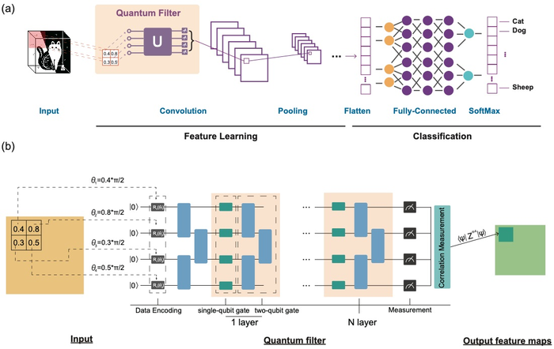
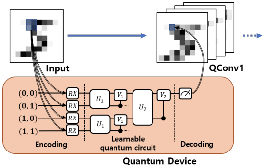
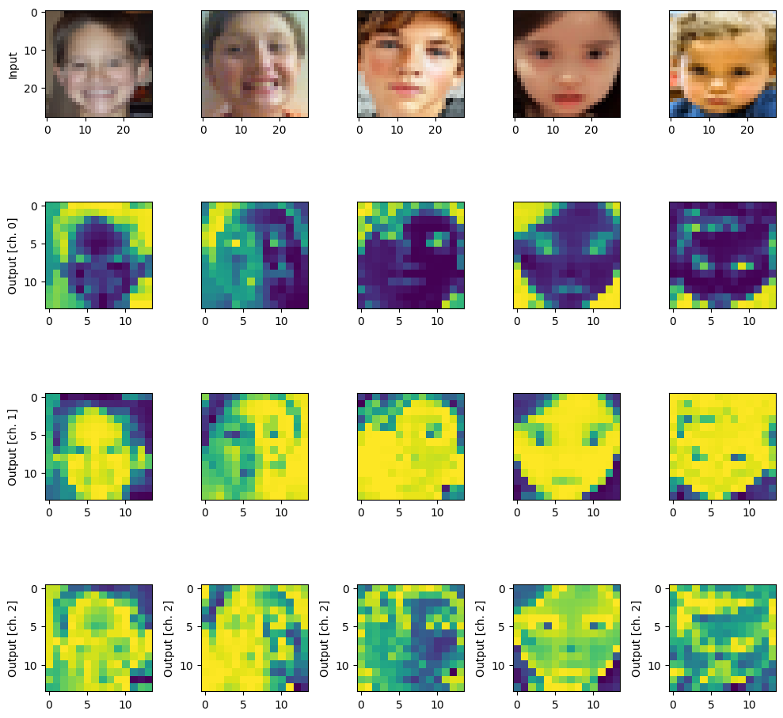
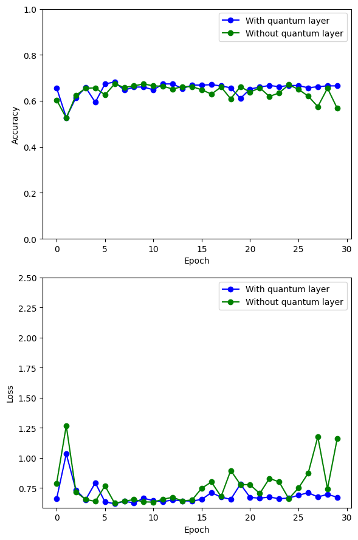

<!DOCTYPE html>
<html>
<head>
  <link rel="stylesheet" type="text/css" href="styles.css">
</head>
<body>

- **Organization**
  - [Indian Institute of Technology Jodhpur](https://iitj.ac.in)
- **Student**
  - [Shisheer S Kaushik](https://www.linkedin.com/in/shisheerkaushik24/)
  - [Thirumalai M](https://www.linkedin.com/in/m-thirumalai/)
  - [Haris Ansari](https://www.linkedin.com/in/haris-ansari-647861176/)
- **Mentors**
  - [Anand Mishra](https://research.iitj.ac.in/researcher/anand-mishra)
  

# Contents
<nav>
  <ul>
	  <li><a href="#section1">Automated Medical Image Diagnostics using QML</a></li>
	  <li><a href="#section2">The Paradigm of QuantumCNN</a></li>
    <li><a href="#section3">Applications of QCNN</a></li>
    <li><a href="#section4">Libraries summarized as follows:</a></li>
    <li><a href="#section5">The project workflow:</a></li>
    <li><a href="#section6">Conclusion</a></li>
    <li><a href="#section7">Resources</a></li>
  </ul>
</nav>

<section id="section1">
  <h2>Automated Medical Image Diagnostics using QML</h2>
  

Autism is categorized as neuro-developmental disorder which has severe effects on social growth and development in children and adults. Although its complete cure seems not possible but early diagnosis is preferable as it helps in more effective treatment compared to conventional behavioural investigations that take much time in detecting and diagnosing ASD by analysing children behaviour in clinics1. ASD has been mostly diagnosed in 2 years old child but it can be diagnosed in children later depending on complexity of symptoms and severity of the disorder2. It has generally occurred due to environmental factors or any genetic linkage which not only effects the nervous system but also has an overall impact on social and cognitive skills of the children and adults. The extent and the intensity of its symptoms are quite variable. Common signs of the condition include difficulty in communication particularly in social situations, obsessional interests, and repeated mannerisms3. A complete examination is needed to detect ASD comprising thorough evaluation and series of assessments performed by child healthcare professionals and psychologists. Early treatment and diagnosis of ASD are crucial since they help to somewhat lessen symptoms, which enhances the person's overall quality of life4. However, a lot of critical time can be lost in diagnosing ASD because it cannot be properly detected by depicting only behaviours of children or adults in clinic. Autism can be identified as early as possible using a range of clinical approaches, but actually these are time-consuming diagnostic procedures infrequently carried out unless the predictive risk of ASD development is high5. Quantum Machine learning (QML) gives an opportunity to train ASD models in less time and more accuracy6. ML techniques are crucial for quick and accurate assessment of ASD risk and streamlining the entire diagnostic process which assist families in getting to the critical therapies more quickly7. Various classification models of QML can be used for early prediction of autism to prevent its prolonged effects in adults as well as children8.

  

</section>

<section id="section2">
  <h2>The Paradigm of QuantumCNN</h2>
  

    
QCNN, or Quantum Convolutional Neural Network extends the key features and structures of existing CNN to quantum systems. When a quantum physics problem defined in the many-body Hilbert space is transferred to a classical computing environment, the data size grows exponentially in proportion to the system size, making it unsuitable for efficient solutions. Because data in a quantum environment can be expressed using qubits, the problem can be avoided by applying a CNN structure to a quantum computer. Now, let us have a look at the architecture of the QCNN model.

As shown in the above architecture, the QCNN model applies the convolution layer and the pooling layer which are the key features of CNN, to the quantum systems.

1. The hidden state is discovered by applying multiple qubit gates between adjacent qubits in the convolution circuit.
2. The pooling circuit reduces the quantum’s system size by observing the qubit fraction or applying CNOT gates to nothing but two-qubit gates.
3. Re-create the convolution and pooling circuits from steps 1 and 2.
4. If the size of the system is small enough, The classification result is predicted by a fully connected circuit.

The Multiscale Entanglement Renormalization Ansatz (MERA) is commonly used to satisfy this structure. MERA is a model for efficiently simulating many-body state quantum systems. MERA now adds qubits to the quantum system, increasing its size exponentially for each depth. This MERA is used in the opposite direction by QCNN. The reversed MERA, which is suitable as a model of QCNN, reduces the size of the quantum system exponentially from the given data
    
  

</section>

<section id="section3">
  <h2>Applications of QCNN</h2>
  

    
One of the most popular applications of CNN is in the field of image classification. In terms of superposition and parallel computation, quantum computers offer significant advantages. Quantum Convolutional Neural Network improves CNN performance by incorporating quantum environments. In this section, we’ll look at how the QCNN can help with image classification.

The quantum convolution layer is a layer in a quantum system that behaves like a convolution layer. To obtain feature maps composed of new data, the quantum convolution layer applies a filter to the input feature map. Unlike the convolution layer, the quantum convolution layer uses a quantum computing environment for filtering. Quantum computers offer superposition and parallel computation, which are not available in classical computing and can reduce learning and evaluation time. Existing quantum computers, on the other hand, are still limited to small quantum systems.

Small quantum computers can construct the quantum convolution layer because it does not apply the entire image map to a quantum system at once but rather processes it as much as the filter size at a time. The quantum convolution layer can be constructed as shown in the diagram below. The following is an explanation of how the concept works:

1. During the encoding process, the pixel data corresponding to the filter size is stored in qubits.
2. Filters in learnable quantum circuits can detect the hidden state from the input state.
3. The decoding process obtains new classical data by measuring.
4. To finish the new feature map, repeat steps 1–3 once more.
   
The first step’s encoding is a process that converts classical information into quantum information. The simplest method is to apply a rotation gate to qubits that correspond to pixel data. Of course, different encoding methods exist, and the encoding method chosen can affect the number of qubits required as well as the learning efficiency. The third decoding process is based on the measurement of one or more quantum states. Classical data is determined by measuring quantum states.

A combination of multiple gates can be used to create the random quantum circuit in the second step. By adding variable gates, the circuit can also perform optimization using the gradient descent method. This circuit can be designed in a variety of ways, each of which has an impact on learning performance.
    
  

</section>

<section id="section4">
  <h2>Libraries summarized as follows</h2>
  

    
1. **PennyLane (`pennylane`):**
   - **Purpose:** PennyLane is a library for differentiable programming of quantum computers. It allows users to define quantum circuits and seamlessly integrate them with classical machine learning frameworks like TensorFlow.

2. **NumPy (`np`):**
   - **Purpose:** NumPy is a powerful library for numerical operations in Python. It is extensively used for mathematical and array operations.

3. **PennyLane Templates (`pennylane.templates`):**
   - **Purpose:** This module provides pre-defined quantum circuit templates. In this code, `RandomLayers` is used to implement a random quantum circuit.

4. **TensorFlow (`tf`):**
   - **Purpose:** TensorFlow is an open-source machine learning library. In this code, it's used for building, training, and evaluating classical deep learning models.

5. **Keras (`keras`):**
   - **Purpose:** Keras is a high-level neural networks API running on top of TensorFlow. It provides an easy-to-use interface for building and training neural networks.

6. **Matplotlib (`plt`):**
   - **Purpose:** Matplotlib is a 2D plotting library for creating visualizations. In this code, it's used for plotting accuracy and loss curves.

7. **OS (`os`):**
   - **Purpose:** The `os` module provides a way to interact with the operating system. It's used here to handle file paths and check if directories exist.

8. **PIL (`Image` from `PIL`):**
   - **Purpose:** The Python Imaging Library (PIL) is used for opening, manipulating, and saving image files. In this code, it's used to load and preprocess images.

9. **Scikit-learn (`train_test_split`):**
   - **Purpose:** Scikit-learn is a machine learning library. The `train_test_split` function is used to split the dataset into training and testing sets.

  

</section>

<section id="section5">
  <h2>The project workflow</h2>
  

  
This project integrates quantum processing into a classical deep learning pipeline, demonstrating the potential of quantum convolution in image classification tasks. The readme file could further discuss the implications of combining quantum and classical approaches and interpret the training results.

1. **Initialization and Configuration:**
   - The code starts by importing necessary libraries, including PennyLane for quantum computing, TensorFlow for classical deep learning, and Matplotlib for visualization.
   - Parameters such as the number of optimization epochs (`n_epochs`), the number of random layers in the quantum circuit (`n_layers`), and dataset sizes are set.

2. **Dataset Loading and Preprocessing:**
   - Images and labels are collected from the "consolidated" dataset folder, where images are categorized into "Autistic" and "Non_Autistic" subfolders.
   - Labels are encoded with indices for autistic and non-autistic classes.
   - Image preprocessing involves resizing, normalization, and adding an extra dimension for convolution channels. The dataset is then split into training and testing sets using `train_test_split` from scikit-learn.
  

3. **Quantum Circuit Definition (`circuit`):**
   - A quantum device with 4 qubits is created using PennyLane.
   - The quantum circuit `circuit` is defined as a QNode (quantum node) using PennyLane's automatic differentiation interface. It consists of encoding classical input values, applying random quantum layers, and measuring classical output values.

4. **Quantum Convolution (`quanv`):**
   - The function `quanv` convolves the input image with multiple applications of the same quantum circuit. It processes squared 2x2 regions of the image using the quantum circuit, producing a quantum-processed image with multiple channels.

5. **Quantum Pre-processing of Images:**
   - Training and test images are quantum pre-processed using the `quanv` function. The quantum circuit is applied to 2x2 regions of each image, and the results are stored in `q_train_images` and `q_test_images`.

6. **Saving Pre-processed Images:**
   - The quantum pre-processed images are saved in a specified directory.

7. **Visualization:**
   - A visualization is created to show original and quantum-processed images side by side. The first row displays original images, and subsequent rows display the output channels of the quantum-processed images.

8. **Neural Network Model Definition (`MyModel`):**
   - A simple Keras model (`MyModel`) is defined with a flatten layer and a dense layer with softmax activation. Two models are created: `q_model` for quantum-processed images and `c_model` for classical images.

9. **Model Training:**
   - Both models are trained using the pre-processed quantum images (`q_model`) and original images (`c_model`).
   - Training history is recorded for later visualization.

10. **Accuracy and Loss Visualization:**
    - Matplotlib is used to visualize the accuracy and loss of the quantum model and classical model over epochs. The results are shown in two subplots, one for accuracy and one for loss, comparing the performance with and without the quantum layer.

 
 
  

</section>

<section id="section6">
  <h2>Conclusion</h2>
  

The research work demonstrates the various results of the benchmarking with respect to the characteristics compared.
    
  

</section>

<section id="section7">
  <h2>Resources</h2>
  

    
- [A Quantum Approximate Optimization Algorithm](https://arxiv.org/abs/1411.4028/)
- [Qiskit-Optimization](https://github.com/Qiskit/qiskit-optimization/blob/59d293d9d258eb3e8d780804252c1bdf5553e339/docs/tutorials/06_examples_max_cut_and_tsp.ipynb/)
- [Integer Programming Formulation of Traveling Salesman Problems](https://www.semanticscholar.org/paper/Integer-Programming-Formulation-of-Traveling-Miller-Tucker/f310643a22ec50a74a64f6203932b9407215d964/)
- [The Traveling Salesman Problem: A Computational Study](https://press.princeton.edu/books/hardcover/9780691129938/the-traveling-salesman-problem)

  

</section>

<a id="scroll-to-top" href="#top">&#8593;</a>

</body>
</html>

