<!DOCTYPE html>
<html>
<head>
  <link rel="stylesheet" type="text/css" href="styles.css">
</head>
<body>
  
# Contents
<nav>
  <ul>
	  <li><a href="#section1">Vehicle Routing Problem</a></li>
	  <li><a href="#section2">The overall workflow we demonstrate comprises:</a></li>
    <li><a href="#section3">The project procedure can be summarized as follows:</a></li>
    <li><a href="#section4">Conclusion</a></li>
    <li><a href="#section5">Variational Quantum EigenSolver (VQE)</a></li>
    <li><a href="#section6">Quantum Approximate Optimization Algorithm (QAOA)</a></li>
    <li><a href="#section7">Results</a></li>
    <li><a href="#section8">Solving VRP using Quantum Annealing technique</a></li>
    <li><a href="#section9">Resources</a></li>
  </ul>
</nav>

<section id="section1">
  <h2>Vehicle Routing Problem</h2>
  

The Vehicle routing problem (VRP) is an NP-hard optimization problem that has been an interest of research fordecades in science and industry. The gist of the project is to plan routes of vehicles to deliver goods to a fixed number of customers with optimal efficiency. Classical tools and methods provide good approximations to reach the optimal global solution. Quantum computing and quantum machine learning provide a new approach to solving combinatorial optimization of problems faster due to inherent speedups of quantum effects. Many solutions of VRP are offered across different quantum computing platforms using hybrid algorithms such as quantum approximate optimization algorithm and quadratic unconstrained binary optimization. In this work, we build a basic VRP solver for 3 and 4 cities using the **variational quantum eigensolver** on a *fixed ansatz*. The Project work is further extended to evaluate the robustness of the solution in several examples of noisy quantum channels. The performance of the quantum algorithm depends heavily on what noise model is used. In general, noise is detrimental, but not equally so among different noise sources.
    
  

</section>

<section id="section2">
  <h2>The overall workflow we demonstrate comprises:</h2>
  

    
  1. Establish the client locations. Normally, these would be available ahead of the day of deliveries from a database. In our use case, we generate these randomly.
  2. compute the pair-wise distances, travel times, or similar. In our case, we consider the Euclidean distance, “as the crow flies”, which is perhaps the simplest possible.
  3. compute the actual routes. This step is run twice, actually. First, we obtain a reference value by a run of a classical solver `(IBM CPLEX)` on the classical computer. Second, we run an alternative, hybrid algorithm partly on the quantum computer.
  4. visualization of the results. In our case, this is again a simplistic plot.
  5. In the following, we first explain the model, before we proceed with the installation of the pre-requisites and the data loading.
    
  

</section>

<section id="section3">
  <h2>The project procedure can be summarized as follows:</h2>
  

    
  1. Initialization *Install pip install qiskit-optimization`[cplex]`
  2. initializer class that randomly places the nodes in a 2-D plane and computes the distance between them.
  3. Classical solution using `IBM ILOG CPLEX`
  4. Instantiate the classical optimizer class
  5. Solve the problem in a classical fashion via `CPLEX`
  6. Visualize the solution
  7. Quantum solution from the ground up
  8. Instantiate the quantum optimizer class with parameters
  9. Check if the binary representation is correct
  10. Encode the problem as an instance of `QuadraticProgram`
  11. Solve the problem via `MinimumEigenOptimizer`
  12. Visualize the solution

  

</section>

<section id="section4">
  <h2>Conclusion</h2>
  

The research work demonstrates the various results of the benchmarking with respect to the characteristics compared.
    
  

</section>

<section id="section5">
  <h2>Variational Quantum EigenSolver (VQE)</h2>
  

**Benchmarking results for 3 nodes + depot (1) &  2 vehicles tested on `ibmq_qasm_simulator** 

<table align="center">
  <caption>Comparison results of `ibmq_qasm_simulation` and `ibm_quito`</caption>
  <tr>
    <td>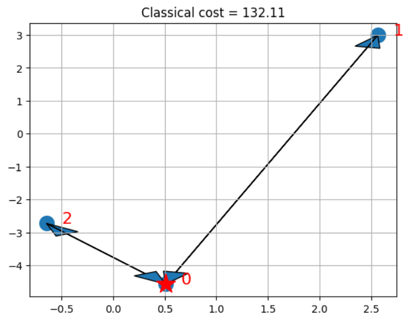</td>
    <td>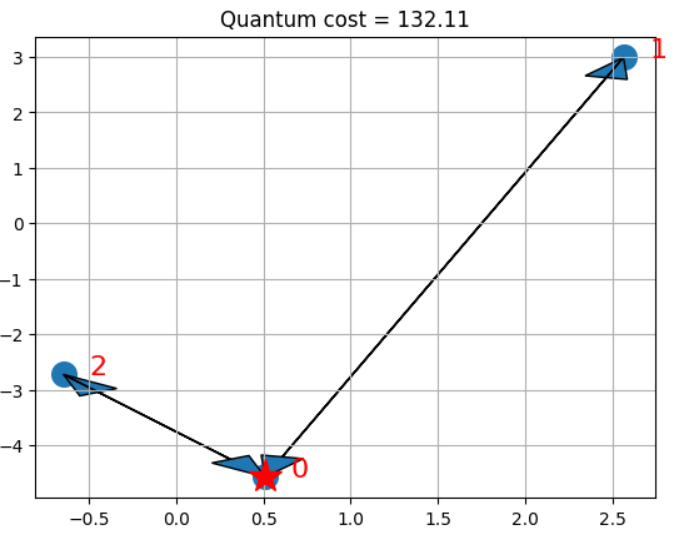</td>
  </tr>
</table>

**Benchmarking results for 4 nodes + depot (1) &  3 vehicles tested on `ibmq_qasm_simulator`** 

<table align="center">
  <caption>Comparison results of `ibmq_qasm_simulation` and `ibm_quito`</caption>
  <tr>
    <td>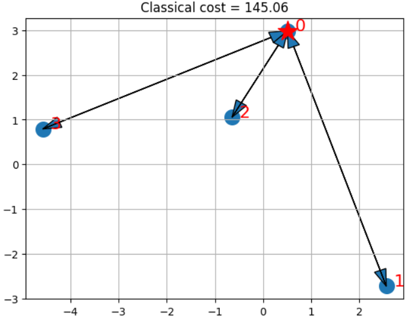</td>
    <td>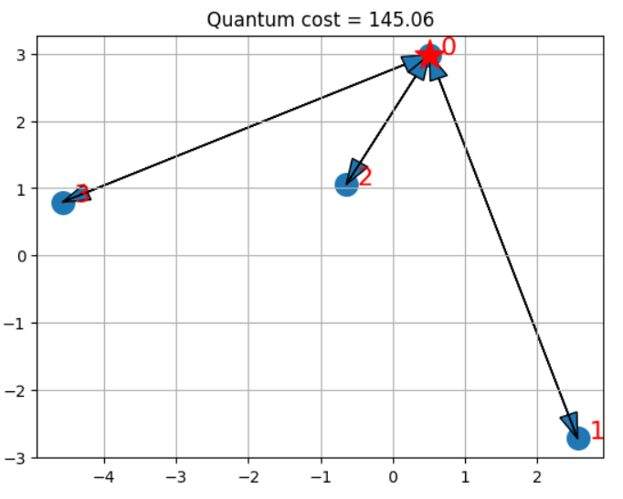</td>
  </tr>
</table>

**Benchmarking results when tested on various *optimizers*, using `SPSA`, `L_BFGS_B` and `SLQSP`** 

<table align="center">
  <caption>Comparison results obtained when 3 discreet optimizers were utilized and simulated on `ibmq_qasm_simulation` </caption>
  <tr>
    <td>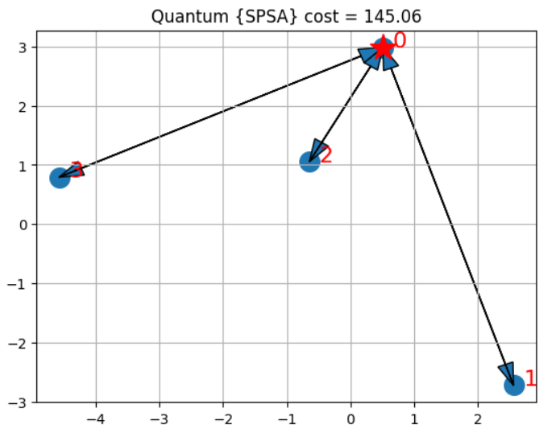</td>
    <td>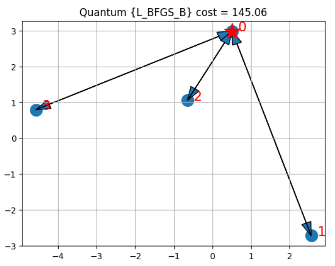</td>
    <td>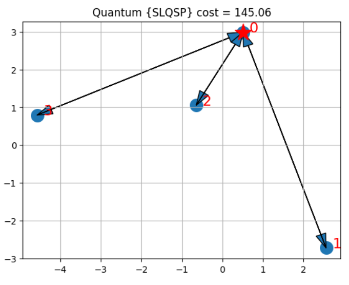</td>
  </tr>
</table>

**Benchmarking results for 5 nodes + depot (1) &  4 vehicles tested on `ibmq_qasm_simulator** 

<table align="center">
  <caption>Comparison results of `ibmq_qasm_simulation` and `ibm_oslo`</caption>
  <tr>
    <td>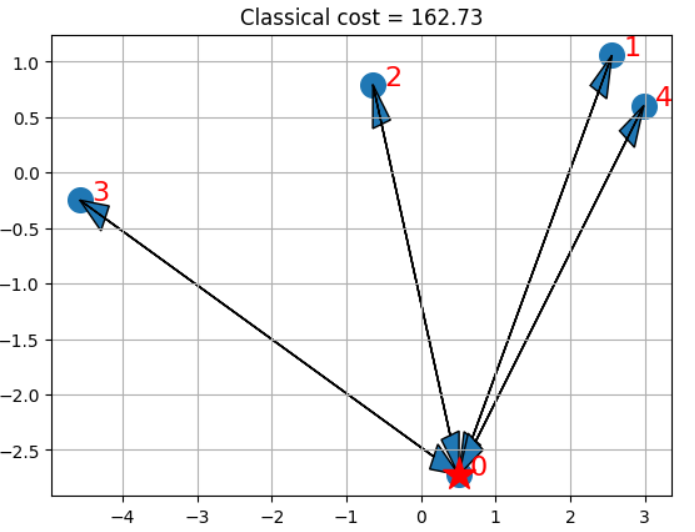</td>
    <td>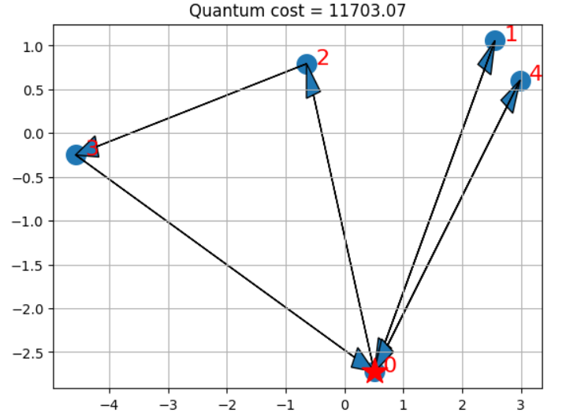</td>
  </tr>
</table>
  
  

</section>

<section id="section6">
  <h2>Quantum Approximate Optimization Algorithm (QAOA)</h2>
  

**Benchmarking results when tested on 2 different *optimizers*, using `SPSA` and `COBYLA` for 5 nodes + depot (1) &  4 vehicles** 

<table align="center">
  <caption>Comparison results obtained when 2 discreet optimizers such as `COBYLA` and `SPSA`were utilized and simulated on `ibmq_qasm_simulation`</caption>
  <tr>
    <td>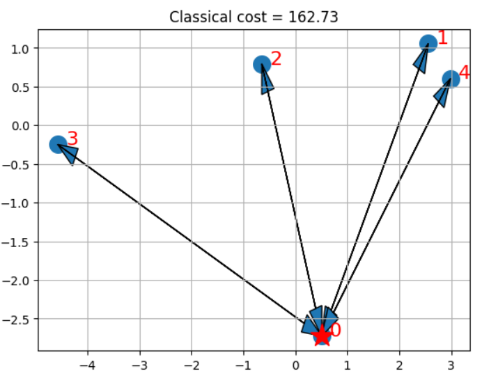</td>
    <td>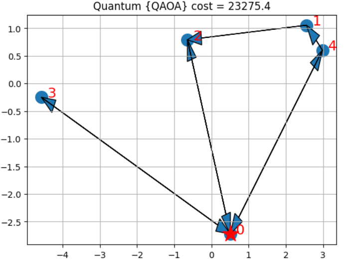</td>
    <td>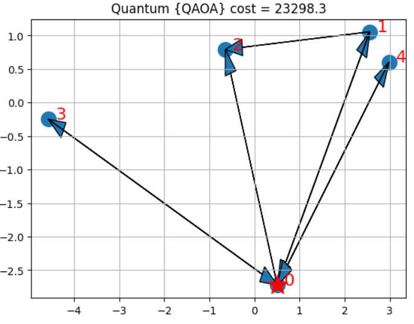</td>
  </tr>
</table>
  
  

</section>

<section id="section7">
  <h2>Results</h2>
  

This result discusses, there is a drastic variation between classical {expected) cost and Quantum cost in few of the cases and some cases have a similar costs.

There were certain factors which might have caused the error:

1. Using a 'qasm simulator' it will use sampling (shots) from the ideal distribution so there will be shot (sampling) noise in any given value. 

2. The type optimizer utilized, as it needs to find a minimum in this noise - some best optimizers which could be ufor VRP **[ SPSA, L_BFGS, COBYLA, SLSQP ]** which was designed to work in noise is a reasonable choice. 

3. Also the type of algorithm matters, In case of variational - `SamplingVQE`. The anstaz is customisable [One has the freedom to can choose or make a difference too]. But, the **QAOA** comes with its default ansataz.
    
  

</section>

<section id="section8">
  <h2>Solving VRP using Quantum Annealing technique</h2>
  

    
Similarly an attempt to to use Quantum Annealing technique is performed by using Dwave-ocean-sdk and the implementation data and its test results can be found [here:](https://github.com/ShisheerKaushik24/Junior-Researcher-Project-/tree/master/vehicle-routing/D-wave-annealer)

<table align="center">
  <caption>Comparison results obtained when 3 discreet test_input{graphs} were simulated on `D-wave CPU` </caption>
  <tr>
    <td>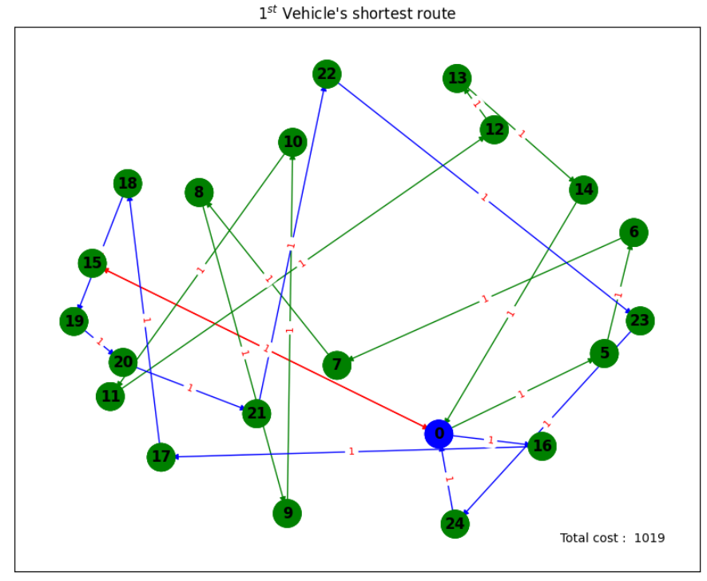</td>
    <td>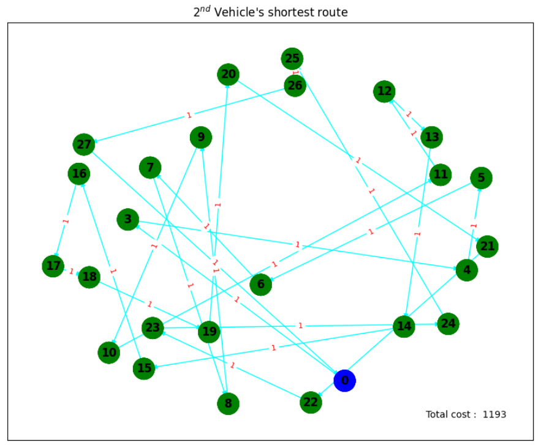</td>
    <td>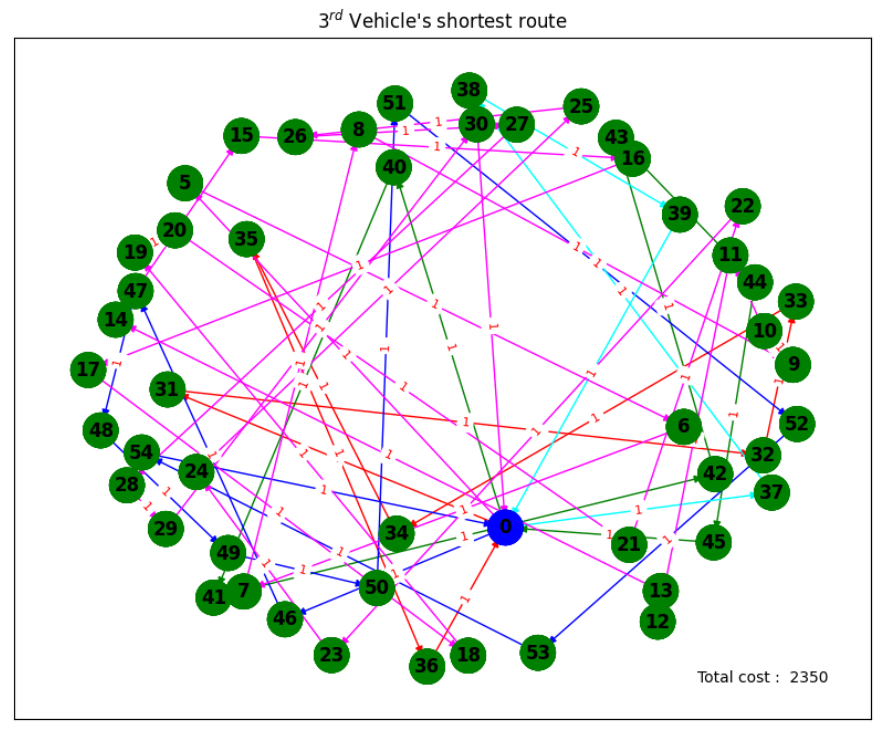</td>
  </tr>
</table>

<table align="center">
  <caption>Comparison results obtained when 3 discreet test_input{graphs} were computed on `D-Wave 2000Q QPU` </caption>
  <tr>
    <td>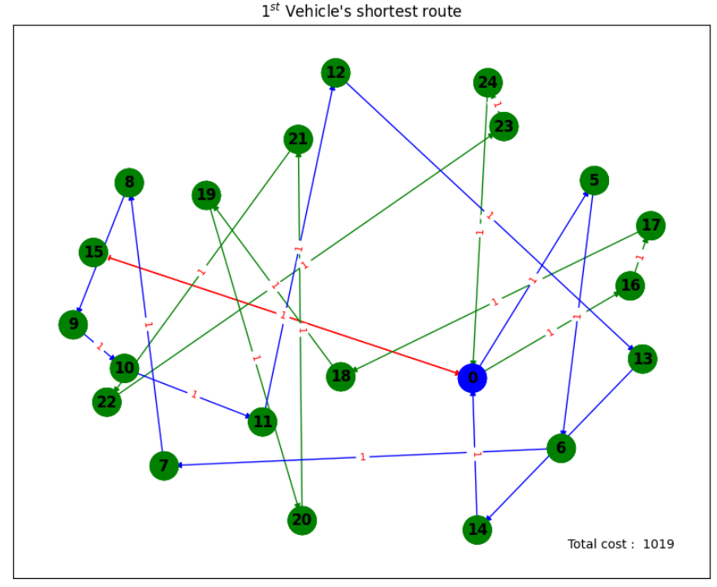</td>
    <td>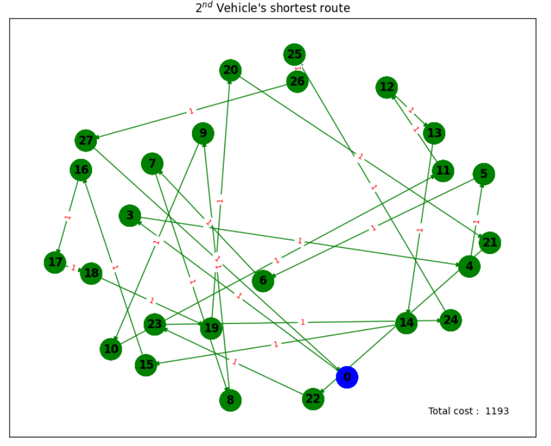</td>
    <td>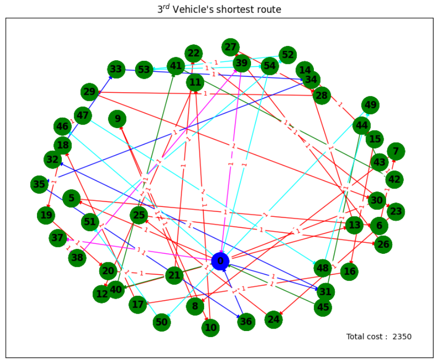</td>
  </tr>
</table>

As seen in the above results, there are many different vehicles which are travelling in accordance with the defined input{graph}, hence each fastest and cost efficient routes are highligted using different sets of color combination. The depot is highlighted with *Blue* color to distinguish with other nodes. 

Note that there are two input formats: 

- Full input
  The full input needs a graph file and a test file. In a graph file, you need to provide edges description: each line should contain two nodes' ids and cost. Cost is related to   what you want to optimize, for example: distance or time. In a test file, you need to provide information about depots, destinations and vehicles. If you want to solve an       instance of **MDVRP (without capacities)**, you only need to provide depots' and destinations' ids and the number of vehicles. If you want to solve **CMDVRP**, you also need     to provide destinations, weights and vehicles capacities.

- Normal input
  It needs only a test file. You need to provide information about depots, destinations, vehicles and costs of travelling between depots and destinations. If you want to solve     MDVRP (without capacities), you only need to provide depots and destinations ids, number of vehicles and costs. Similar to Full Input, its the same condition in case of          **CMVRP**

Depots and destinations are enumerated with natural numbers. If you have n depots and m destinations, depots will have numbers 0, 1, 2, ..., n - 1 and destinations will have     numbers n, n + 1, n + 2, ..., n + m - 1. You need to provide (n + m) x (n + m) matrix with costs.

The problem uses `DBScanSolver` for *MDVRP*. It also uses another solver (solver attribute) to solve problems like VRP and TSP, and then tries to divide the solution to         consecutive parts that will be served by vehicles. There is also an attribute 'random' - bigger value should give better solutions with bigger execution time.Using this         solver with `DBScanSolver` should give the best effect. On smaller tests (with the number of destinations up to 50), you can use it with `FullQuboSolver` to reduce the size of   QUBO. Note that using this solver with `AveragePartitionSolver` is exactly the same as using it with `FullQuboSolver`. 
  
  

</section>
 
  
<section id="section9">
  <h2>Resources</h2>
  

    
- [A Quantum Approximate Optimization Algorithm](https://arxiv.org/abs/1411.4028/)
- [Qiskit-Optimization](https://github.com/Qiskit/qiskit-optimization/blob/59d293d9d258eb3e8d780804252c1bdf5553e339/docs/tutorials/06_examples_max_cut_and_tsp.ipynb/)
- [Integer Programming Formulation of Traveling Salesman Problems](https://www.semanticscholar.org/paper/Integer-Programming-Formulation-of-Traveling-Miller-Tucker/f310643a22ec50a74a64f6203932b9407215d964/)
- [The Traveling Salesman Problem: A Computational Study](https://press.princeton.edu/books/hardcover/9780691129938/the-traveling-salesman-problem)
 
**Quantum Annealing**
- [Thermally assisted quantum annealing of a 16-qubit problem](https://www.nature.com/articles/ncomms2920)
- [Quantum annealing with manufactured spins](https://www.researchgate.net/publication/51117464_Quantum_annealing_with_manufactured_spins)
- [Entanglement in a Quantum Annealing Processo](https://journals.aps.org/prx/pdf/10.1103/PhysRevX.4.021041)

    
  

</section>

<a id="scroll-to-top" href="#top">&#8593;</a>

</body>
</html>
